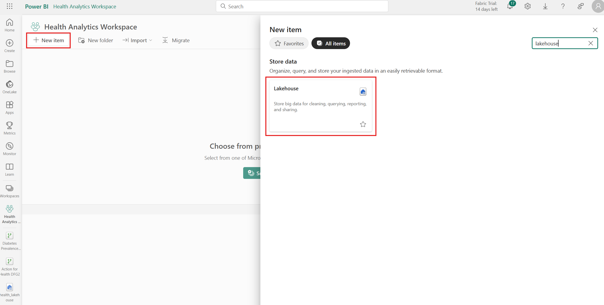
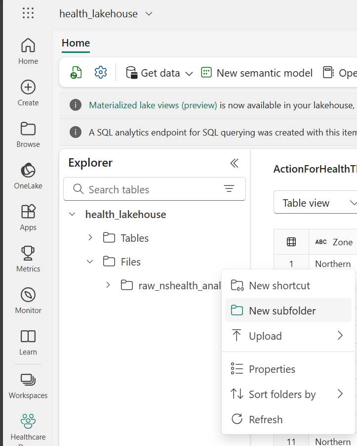
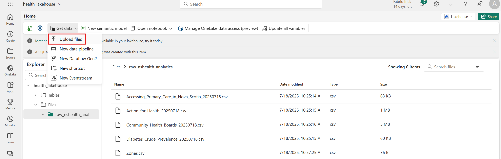

# Tutorial Instructions

## Part 1: Workspace and Lakehouse Setup
1. In this repository, go to health-analytics/data and download all files in the folder.
2. Navigate to https://app.fabric.microsoft.com/and sign in.
3. Create a new workspace. Click on Workspaces >> +New Workspace, as shown in the screenshot below. You can name your workspace whatever you'd like (recommendation: Health Analytics Tutorial).

4. In your workspace, click on +New item and search for "Lakehouse." You can name the Lakehouse whatever you'd like (recommendation: health_lakehouse).

5. Now, we'll upload the data files downloaded in step 1 to the Lakehouse Files. First, create a new subfolder called "raw_nshealth_analytics:"

6. Open the subfolder, click on Get data >> Upload files. Upload all the files downloaded in step 1. 

## Part 2: Data Transformation / Cleansing

## Part 3: Semantic Model Preparation

## Part 4: Data Visualization
