# Tutorial Instructions
## Tutorial Overview
The diagram below provides a high-level overview of the steps we'll follow in this tutorial.


## Part 1: Workspace and Lakehouse Setup
1. In this repository, go to health-analytics/data and download all files in the folder.
2. Navigate to https://app.fabric.microsoft.com/ and sign in.
3. Create a new workspace. Click on Workspaces >> +New Workspace, as shown in the screenshot below. You can name your workspace whatever you'd like (recommendation: Health Analytics Tutorial).


4. In your workspace, click on +New item and search for "Lakehouse." You can name the Lakehouse whatever you'd like (recommendation: health_lakehouse).


5. Now, we'll upload the data files downloaded in step 1 to the Lakehouse Files. First, create a new subfolder called "raw_nshealth_analytics:"


6. Open the subfolder, click on Get data >> Upload files. Upload all the files downloaded in step 1. 


## Part 2: Data Transformation / Cleansing

#### Action for Health Dataset
7. Return to your workspace, click on +New item, and search for "Dataflow Gen2." Note that the search results will return items under "Get data" and "Prepare data," but both will create a blank Dataflow Gen2 (choosing either option is fine). Name the Dataflow Gen2 Action for Health DFG2, and and click Create.


Note: As we won't be using Git integration or deployment pipelines in this tutorial, there will be no impact if you uncheck the box, as shown below.


8. The blank DFG2 will open. Click on Get data >> More, then search for and select "Lakehouse."


9. Choose the Workspace you created in step 3, then click on the Lakehouse you created in step 4. Open the "Files" folder and select "Action_for_Health_20250718.csv." Click Create.
 

10. Let's fix the data quality issues with this file!
    a. The headers didn't come through properly, so navigate to Transform>>Use first row as headers to fix this.
    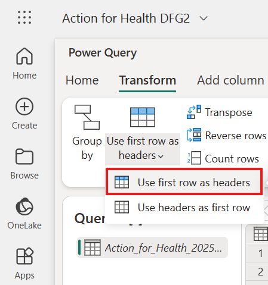

    b. Columns Zone, Type, and CTAS all have blank values, which is not ideal for downstream processing. Let's replace all blank cells with "Unknown." In the Transform tab, click on Repalce values. Leave "Value to find" blank, and enter     "Unknown" in the "Replace with" box, as shown in the screenshot below.
    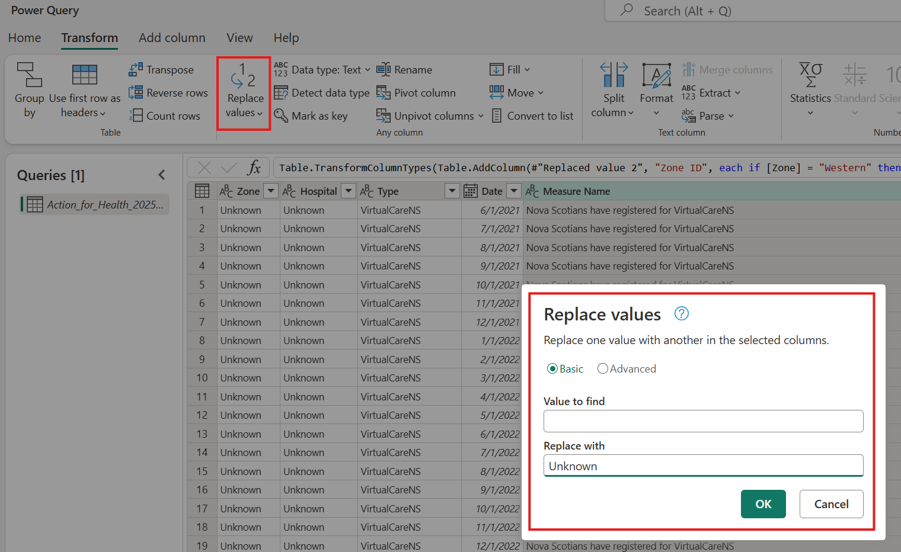

    c. In this dataset, we have the zone name, i.e. Central, Western, etc., but not the associated Zone ID which is preferred for table joins. Let's create a calculated column to get the Zone ID based on the Zone column. In the ribbon, click on Add column>>Custom column.
    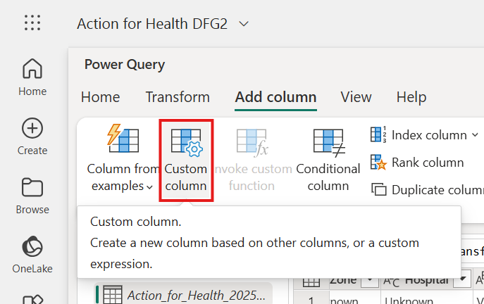

    We need to enter a formula using the DAX expression language to implement the logic. Copy and paste the following formula into the box. Review the screenshot below for comparison, and click OK.
    
    ```
    if [Zone] = "Western" then 1 else if [Zone] = "Northern" then 2 else if [Zone] = "Eastern" then 3 else if [Zone] = "Central" then 4 else 5
    ```

    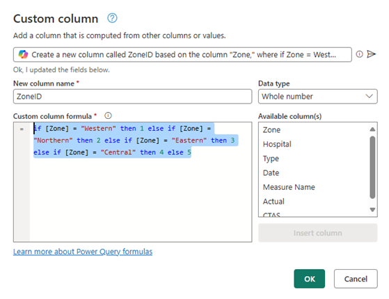

11. We've fixed the data quality issues with the Action for Health dataset! Now, we have to configure the data destination to save the clean data to a Lakehouse table. In the bottom right-hand corner, select Data destination>>Lakehouse.
Note: In the screenshot, the Lakehouse is already configured as a data destination. You will see "No data destination" in your environment.

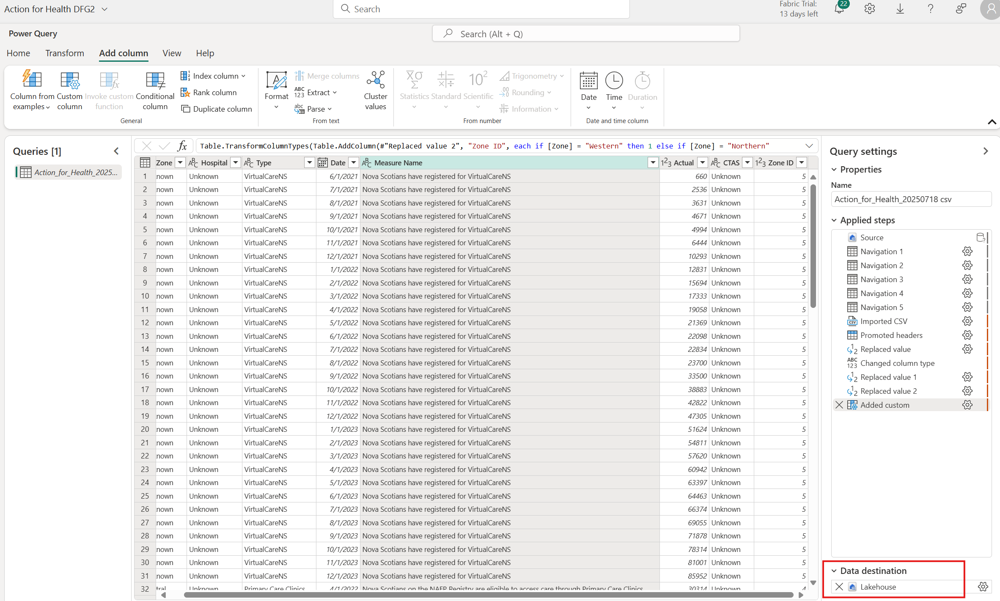

Leave the default connection credentials and click Next. Choose the Lakehouse created in step 4, and update the Table name to "ActionForHealthTbl." Click Next.

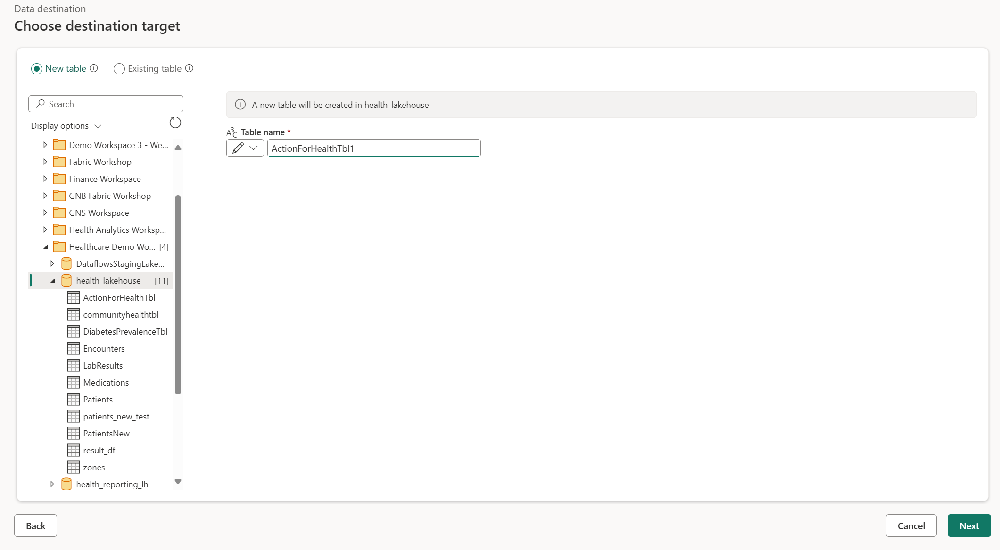

12. Return to the Home tab of your DFG2, and click on Save & run. Once the run is complete, verify that the ActionForHealthTbl table is in your Lakehouse.

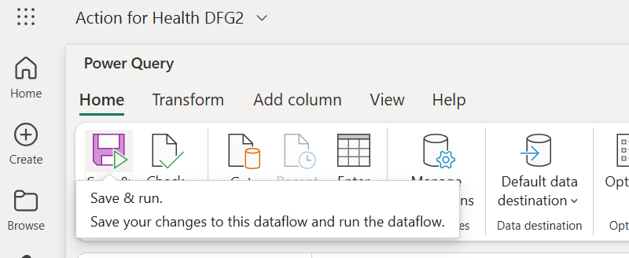

#### Diabetes Prevalence Dataset
13. Repeat steps 7-9, this time for the "Diabetes_Crude_Prevalence_20250718.csv." In step 9, name the DFG2 "Diabetes Prevalence DFG2."

14. Let's fix the data quality issues!
    
    a. The headers did not come through properly. As in 10a, click on Transform>>Use first row as headers. Refer back to the screenshot in that step if needed.

    b. The zones in this file are in a format that isn't compatible with our other tables. Let's split the Zone column using the " - " delimiter. Click on the Zone column and navigate to Transform>>Split column>>By delimiter.

    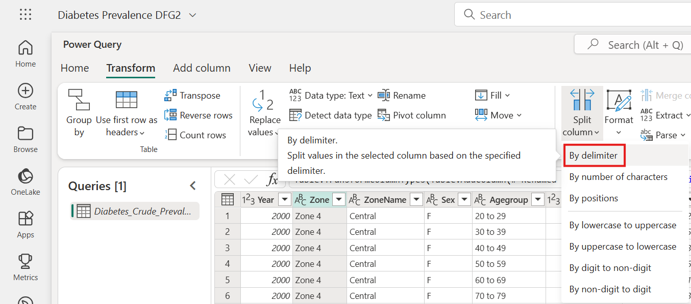

    In the Separator drop-down menu, choose the Custom option.
    
    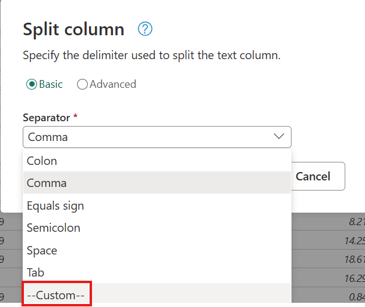

    Enter " - " (without the quotations) as the Separator and click OK.

    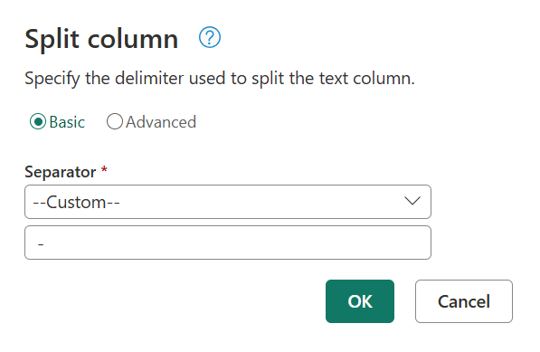

    The newly split columns need to be renamed. Rename Zone.1 to Zone, and Zone.2 to ZoneName. This can be done by double clicking on the column header.

    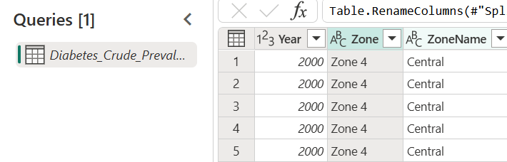

    c. As in 10c, we need to add a calculated column to get the Zone ID. Follow the same steps as in 10c, including copying the DAX formula, to generate the Zone ID column.

    d. Validate all steps have been completed by reviewing the screenshot below (ignore the "Changed column type step, and initial Navigation steps).

    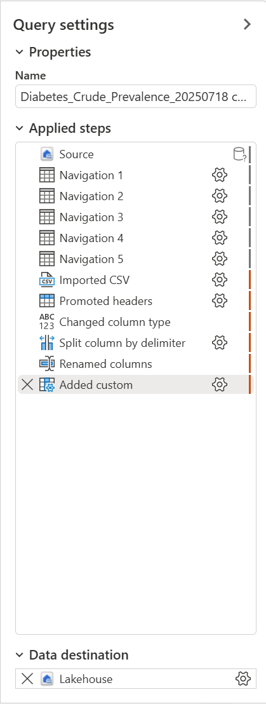

15. Now that the data is clean, we need to configure the Lakehouse destination and save as a table as in steps 11 and 12. Follow these same steps, this time naming the table, "DiabetesPrevalenceTbl."

#### Accessing Primary Care Dataset


#### Zones Dataset
 This file was created to act as a bridging table between multiple tables with Zone ID. Because of this, we know there are no data quality issues, and can take advantage of the Fabric Lakehouse user interface to load Zones into a delta table. In your lakehouse, hover over Zones.csv, click on the ellipsis, then Load to tables>>New table. Name the table Zones, leave the default settings, and click Load.

 

## Part 3: Semantic Model Preparation

## Part 4: Data Visualization
