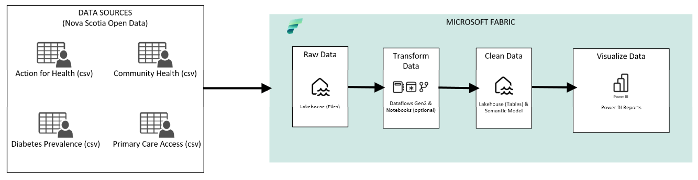
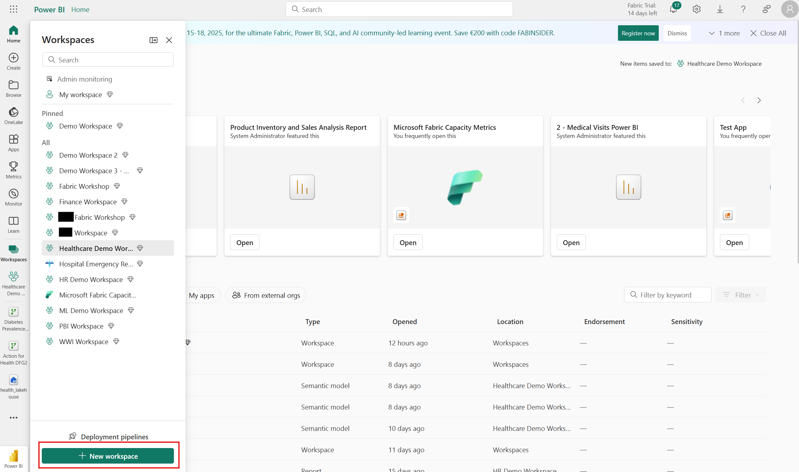
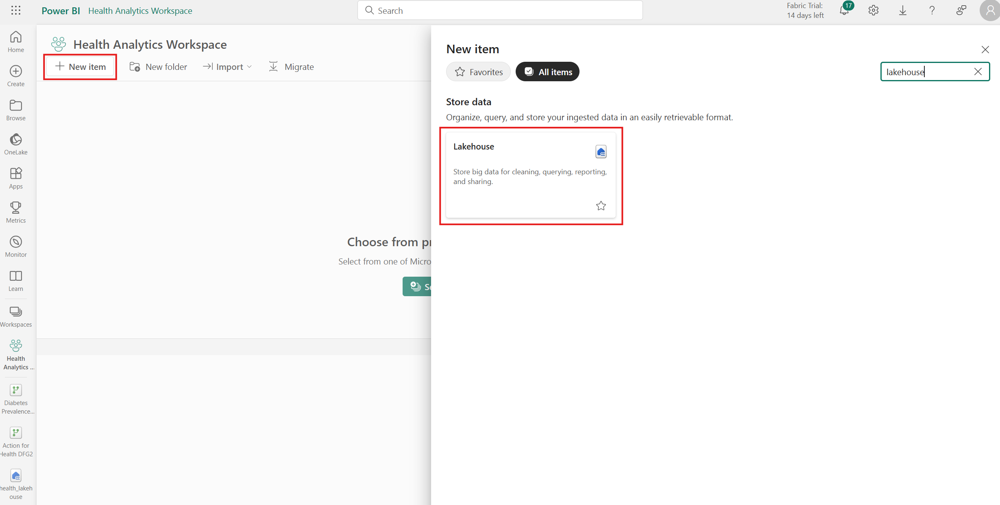
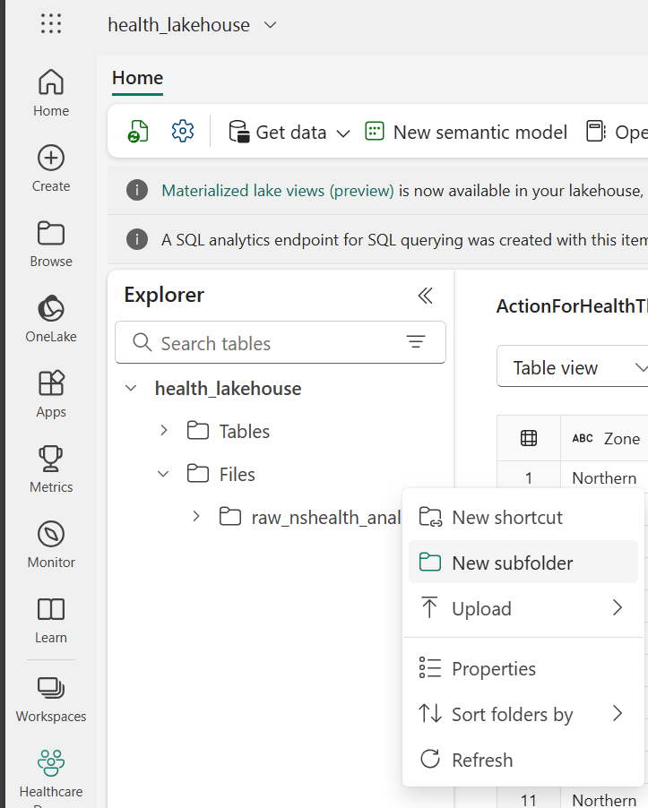
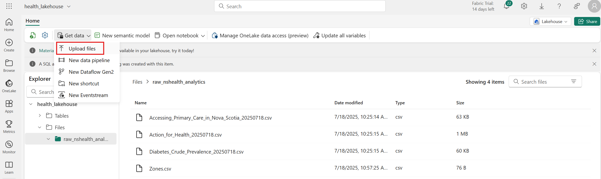
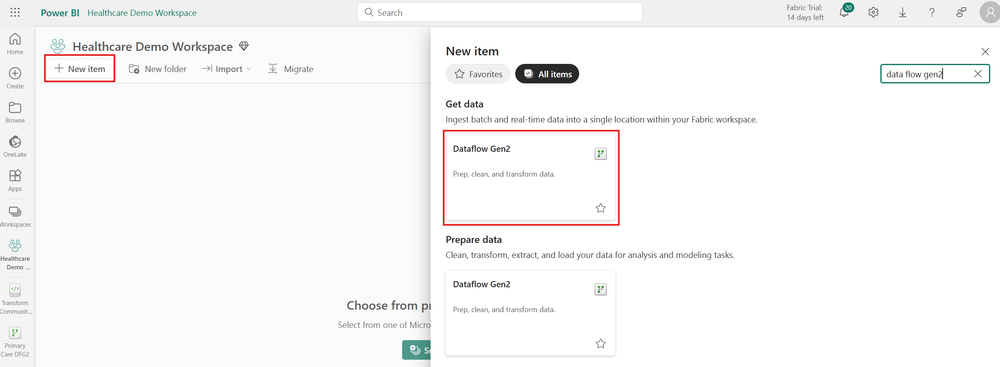
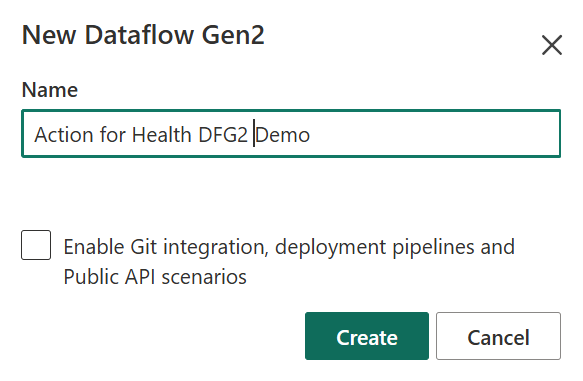
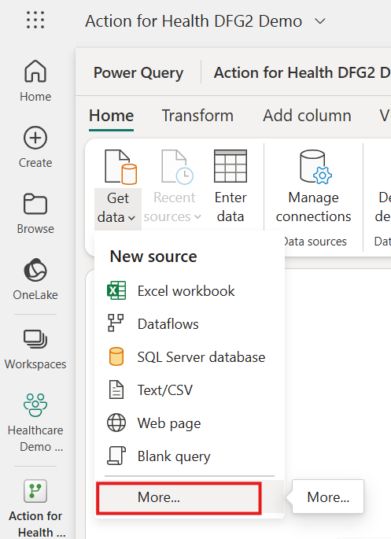
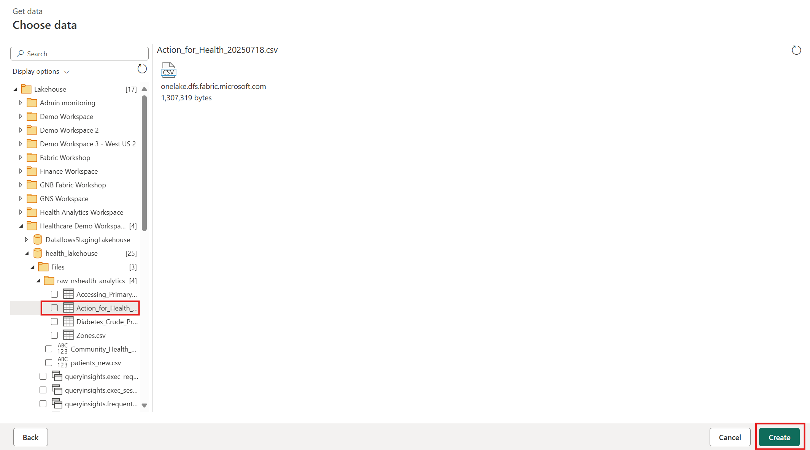

# Tutorial Instructions
## Tutorial Overview
The diagram below provides a high-level overview of the steps we'll follow in this tutorial.

## Part 1: Workspace and Lakehouse Setup
1. In this repository, go to health-analytics/data and download all files in the folder.
2. Navigate to https://app.fabric.microsoft.com/and sign in.
3. Create a new workspace. Click on Workspaces >> +New Workspace, as shown in the screenshot below. You can name your workspace whatever you'd like (recommendation: Health Analytics Tutorial).

4. In your workspace, click on +New item and search for "Lakehouse." You can name the Lakehouse whatever you'd like (recommendation: health_lakehouse).

5. Now, we'll upload the data files downloaded in step 1 to the Lakehouse Files. First, create a new subfolder called "raw_nshealth_analytics:"

6. Open the subfolder, click on Get data >> Upload files. Upload all the files downloaded in step 1. 

## Part 2: Data Transformation / Cleansing
7. Return to your workspace, click on +New item, and search for "Dataflow Gen2." Note that the search results will return items under "Get data" and "Prepare data," but both will create a blank Dataflow Gen2 (choosing either option is fine). Name the Dataflow Gen2 Action for Health DFG2, and and click Create.

Note: As we won't be using Git integration or deployment pipelines in this tutorial, there will be no impact if you uncheck the box, as shown below.

8. The blank DFG2 will open. Click on Get data >> More, then search for and select "Lakehouse."

9. Choose the Workspace you created in step 3, then click on the Lakehouse you created in step 4. Open the "Files" folder and select "Action_for_Health_20250718.csv." Click Create.
 

## Part 3: Semantic Model Preparation

## Part 4: Data Visualization
